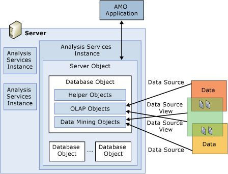
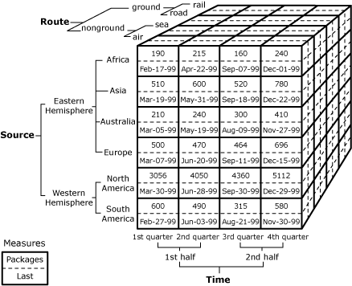
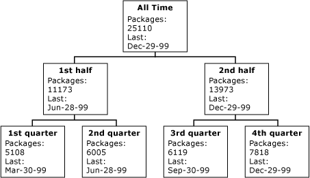

# Logical Architecture Overview (Analysis Services - Multidimensional Data)
  Analysis Services operates in a server deployment mode that determines the memory architecture and runtime environment used by different types of Analysis Services models. Server mode is determined during installation. **Multidimensional and Data Mining mode** supports traditional OLAP and data mining. **Tabular mode** supports tabular models. **SharePoint integrated mode** refers to an instance of Analysis Services that was installed as PowerPivot for SharePoint, used for loading and querying Excel or PowerPivot data models inside a workbook.  
  
 This topic explains the basic architecture of Analysis Services when operating in Multidimensional and Data Mining mode. For more information about other modes, see [Tabular Modeling &#40;SSAS Tabular&#41;](../../tabular-models/tabular-models-ssas.md) and [Comparing Tabular and Multidimensional Solutions &#40;SSAS&#41;](../../../analysis-services/comparing-tabular-and-multidimensional-solutions-ssas.md).  
  
## Basic Architecture  
 An instance of [!INCLUDE[ssASnoversion](../../../includes/ssasnoversion-md.md)] can contain multiple databases, and a database can have OLAP objects and data mining objects at the same time. Applications connect to a specified instance of [!INCLUDE[ssASnoversion](../../../includes/ssasnoversion-md.md)] and a specified database. A server computer can host multiple instances of [!INCLUDE[ssASnoversion](../../../includes/ssasnoversion-md.md)]. Instances of [!INCLUDE[ssASnoversion](../../../includes/ssasnoversion-md.md)] are named as "\<ServerName>\\<InstanceName\>". The following illustration shows all mentioned relationships between [!INCLUDE[ssASnoversion](../../../includes/ssasnoversion-md.md)] objects.  
  
   
  
 Basic classes are the minimum set of objects that are required to build a cube. This minimum set of objects is a dimension, a measure group, and a partition. An aggregation is optional.  
  
 Dimensions are built from attributes and hierarchies. Hierarchies are formed by an ordered set of attributes, where each attribute of the set corresponds to a level in the hierarchy.  
  
 Cubes are built from dimensions and measure groups. The dimensions in the dimensions collection of a cube belong to the dimensions collection of the database. Measure groups are collections of measures that have the same data source view and have the same subset of dimensions from the cube. A measure group has one or more partitions to manage the physical data. A measure group can have a default aggregation design. The default aggregation design can be used by all partitions in the measure group; also, each partition can have its own aggregation design.  
  
 Server Objects  
 Each instance of [!INCLUDE[ssASnoversion](../../../includes/ssasnoversion-md.md)] is seen as a different server object in AMO; each different instance is connected to a <xref:Microsoft.AnalysisServices.Server> object by a different connection. Each server object contains one or more data sources, data source views, and database objects, as well as assemblies and security roles.  
  
 Dimension Objects  
 Each database object contains multiple dimension objects. Each dimension object contains one or more attributes, which are organized into hierarchies.  
  
 Cube Objects  
 Each database object contains one or more cube objects. A cube is defined by its measures and dimensions. The measures and dimensions in a cube are derived from the tables and views in the data source view on which the cube is based, or which is generated from the measure and dimension definitions.  
  
## Object Inheritance  
 The ASSL object model contains many repeated element groups. For example, the element group, "`Dimensions` contain `Hierarchies`," defines the dimension hierarchy of an element. Both `Cubes` and `MeasureGroups` contain the element group, "`Dimensions` contain `Hierarchies`."  
  
 Unless explicitly overridden, an element inherits the details of these repeated element groups from the higher level. For example, the `Translations` for a `CubeDimension` are the same as the `Translations` for its ancestor element, `Cube`.  
  
 To explicitly override properties inherited from a higher-level object, an object does not need to repeat explicitly the entire structure and properties of the higher-level object. The only properties that an object needs to state explicitly are those properties that the object wants to override. For example, a `CubeDimension` may list only those `Hierarchies` that need to be disabled in the `Cube`, or for which the visibility needs to be changed, or for which some `Level` details have not been provided at the `Dimension` level.  
  
 Some properties specified on an object provide default values for the same property on a child or descendant object. For example, `Cube.StorageMode` provides the default value for `Partition.StorageMode`. For inherited default values, ASSL applies these rules for inherited default values:  
  
-   When the property for the child object is null in the XML, the property's value defaults to the inherited value. However, if you query the value from the server, the server returns the null value of the XML element.  
  
-   It is not possible to determine programmatically whether the property of a child object has been set directly on the child object or inherited.  
  
## Example  
 The Imports cube contains two measures, Packages and Last, and three related dimensions, Route, Source, and Time.  
  
   
  
 The smaller alphanumeric values around the cube are the members of the dimensions. Example members are ground (member of the Route dimension), Africa (member of the Source dimension), and 1st quarter (member of the Time dimension).  
  
### Measures  
 The values within the cube cells represent the two measures, Packages and Last. The Packages measure represents the number of imported packages, and the `Sum` function is used to aggregate the facts. The Last measure represents the date of receipt, and the `Max` function is used to aggregate the facts.  
  
### Dimensions  
 The Route dimension represents the means by which the imports reach their destination. Members of this dimension include ground, nonground, air, sea, road, or rail. The Source dimension represents the locations where the imports are produced, such as Africa or Asia. The Time dimension represents the quarters and halves of a single year.  
  
### Aggregates  
 Business users of a cube can determine the value of any measure for each member of every dimension, regardless of the level of the member within the dimension, because [!INCLUDE[ssASnoversion](../../../includes/ssasnoversion-md.md)] aggregates values at upper levels as needed. For example, the measure values in the preceding illustration can be aggregated according to a standard calendar hierarchy by using the Calendar Time hierarchy in the Time dimension as illustrated in the following diagram.  
  
   
  
 In addition to aggregating measures by using a single dimension, you can aggregate measures by using combinations of members from different dimensions. This allows business users to evaluate measures in multiple dimensions simultaneously. For example, if a business user wants to analyze quarterly imports that arrived by air from the Eastern Hemisphere and Western Hemisphere, the business user can issue a query on the cube to retrieve the following dataset.  
  
||||Packages|||Last|||  
|-|-|-|--------------|-|-|----------|-|-|  
||||All Sources|Eastern Hemisphere|Western Hemisphere|All Sources|Eastern Hemisphere|Western Hemisphere|  
|All Time|||25110|6547|18563|Dec-29-99|Dec-22-99|Dec-29-99|  
||1st half||11173|2977|8196|Jun-28-99|Jun-20-99|Jun-28-99|  
|||1st quarter|5108|1452|3656|Mar-30-99|Mar-19-99|Mar-30-99|  
|||2nd quarter|6065|1525|4540|Jun-28-99|Jun-20-99|Jun-28-99|  
||2nd half||13937|3570|10367|Dec-29-99|Dec-22-99|Dec-29-99|  
|||3rd quarter|6119|1444|4675|Sep-30-99|Sep-18-99|Sep-30-99|  
|||4th quarter|7818|2126|5692|Dec-29-99|Dec-22-99|Dec-29-99|  
  
 After a cube is defined, you can create new aggregations, or you can change existing aggregations to set options such as whether aggregations are precalculated during processing or calculated at query time. **Related topic:**[Aggregations and Aggregation Designs](../../multidimensional-models-olap-logical-cube-objects/aggregations-and-aggregation-designs.md).  
  
### Mapping Measures, Attributes, and Hierarchies  
 The measures, attributes, and hierarchies in the example cube are derived from the following columns in the cube's fact and dimension tables.  
  
|Measure or attribute (level)|Members|Source table|Source column|Sample column value|  
|------------------------------------|-------------|------------------|-------------------|-------------------------|  
|Packages measure|Not applicable|ImportsFactTable|Packages|12|  
|Last measure|Not applicable|ImportsFactTable|Last|May-03-99|  
|Route Category level in Route dimension|nonground,ground|RouteDimensionTable|Route_Category|Nonground|  
|Route attribute in Route dimension|air,sea,road,rail|RouteDimensionTable|Route|Sea|  
|Hemisphere attribute in Source dimension|Eastern Hemisphere,Western Hemisphere|SourceDimensionTable|Hemisphere|Eastern Hemisphere|  
|Continent attribute in Source dimension|Africa,Asia,AustraliaEurope,N. America,S. America|SourceDimensionTable|Continent|Europe|  
|Half attribute in Time dimension|1st half,2nd half|TimeDimensionTable|Half|2nd half|  
|Quarter attribute in Time dimension|1st quarter,2nd quarter,3rd quarter,4th quarter|TimeDimensionTable|Quarter|3rd quarter|  
  
 Data in a single cube cell is usually derived from multiple rows in the fact table. For example, the cube cell at the intersection of the air member, the Africa member, and the 1st quarter member contains a value that is derived by aggregating the following rows in the **ImportsFactTable** fact table.  
  
|||||||  
|-|-|-|-|-|-|  
|Import_ReceiptKey|RouteKey|SourceKey|TimeKey|Packages|Last|  
|3516987|1|6|1|15|Jan-10-99|  
|3554790|1|6|1|40|Jan-19-99|  
|3572673|1|6|1|34|Jan-27-99|  
|3600974|1|6|1|45|Feb-02-99|  
|3645541|1|6|1|20|Feb-09-99|  
|3674906|1|6|1|36|Feb-17-99|  
  
 In the preceding table, each row has the same values for the **RouteKey**, **SourceKey**, and **TimeKey** columns, indicating that these rows contribute to the same cube cell.  
  
 The example shown here represents a very simple cube, in that the cube has a single measure group, and all the dimension tables are joined to the fact table in a star schema. Another common schema is a snowflake schema, in which one or more dimension tables join to another dimension table, rather than joining directly to the fact table. **Related topic:**[Dimensions &#40;Analysis Services - Multidimensional Data&#41;](../../multidimensional-models-olap-logical-dimension-objects/dimensions-analysis-services-multidimensional-data.md).  
  
 The example shown here contains only a single fact table. When a cube has multiple fact tables, the measures from each fact table are organized into measure groups, and a measure group is related to a specific set of dimensions by defined dimension relationships. These relationships are defined by specifying the participating tables in the data source view and the granularity of the relationship. **Related topic:**[Dimension Relationships](../../multidimensional-models-olap-logical-cube-objects/dimension-relationships.md).  
  
## See Also  
 [Multidimensional Model Databases &#40;SSAS&#41;](../multidimensional-model-databases-ssas.md)  
  
  
