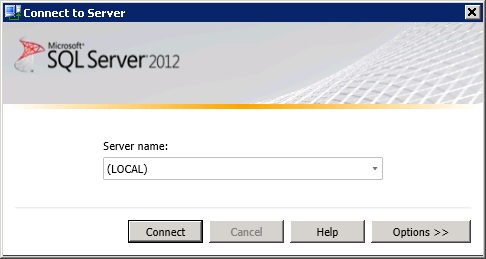
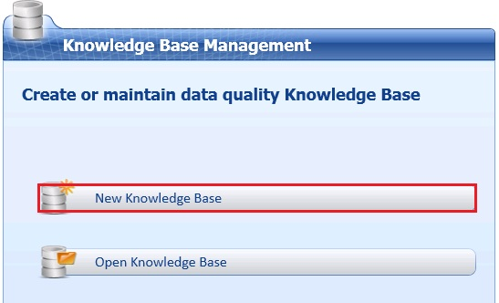
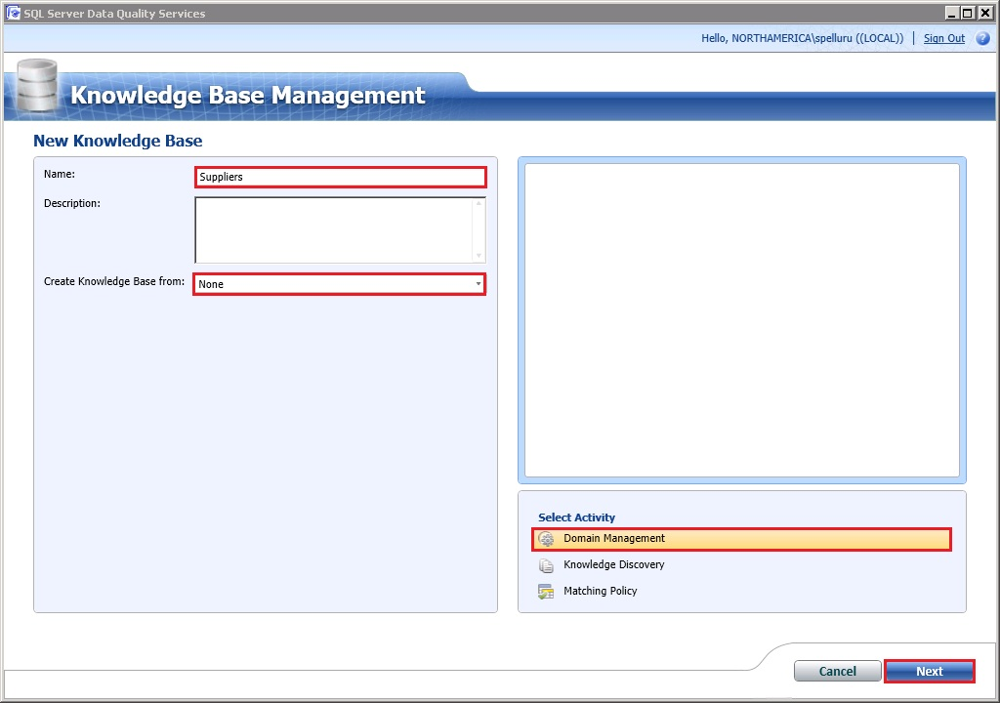
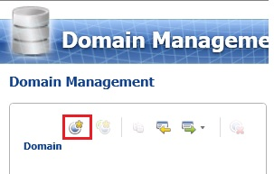
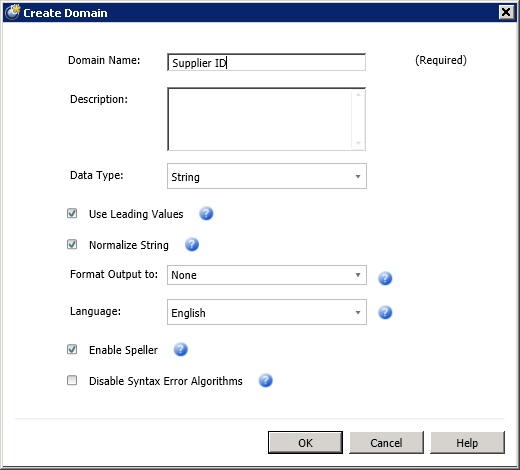

# Task 1: Creating a Knowledge Base and Domains
  In this task, you create the **Suppliers** knowledge base and create domains that is used for cleansing data and matching data to remove duplicates.  
  
1.  Launch **Data Quality Client**. Click **Start**, point to **All Programs**, click **Microsoft SQL Server 2012**, click **Data Quality Services**, and then click **Data Quality Client**.  
  
2.  In the **Connect to Server** dialog box, select the database server instance on which the DQS is installed, and click **Connect**.  
  
       
  
3.  In the Data Quality Client home page, in the **Knowledge Base Management** pane, click **New Knowledge Base**.  
  
       
  
4.  Enter **Suppliers** for **Name** of the knowledge base.  
  
       
  
5.  Confirm that **Create Knowledge Base from** field is set to **None** since you are creating the **Suppliers** knowledge base from scratch.  
  
6.  Confirm that **Domain Management** is selected for the **Activity** and click **Next**. The Domain Management activity lets you create and manage domains in the knowledge base.  
  
7.  In the **Domain Management** window, click **Create a domain** toolbar button to create a domain.  
  
       
  
8.  In the **Create Domain** dialog box, type **Supplier ID** for the **Domain Name**, and click **OK**.  
  
       
  
9. Repeat previous step to create the following domains with all the default settings. To keep the tutorial simple, you set the **Data Type** of all the domains as **String**. The other allowed data types are: Integer, Decimal, and Date. When the **Use Leading Values** option is selected (default), all synonyms are replaced with the leading value of the synonym group in the output. Setting **Normalize String** option (default) removes any special characters in the domain values. The **Format Output to** option lets you select the formatting that is applied when the data values in the domain are output. Select **Enable Speller** (default) to run Speller on all string values when populating the domain. The **Language** setting specifies which language version of the **Speller** you want to apply. Select **Disable Syntax Error Algorithms** to populate the domain without checking string values for syntax errors. See [Create a Domain](https://msdn.microsoft.com/library/hh510401.aspx) topic in the MSDN library for more details.  
  
    -   Supplier Name  
  
    -   Contact Email  
  
    -   Address Line  
  
    -   City  
  
    -   State  
  
    -   Country  
  
    -   Zip  
  
## Next Step  
 [Task 2: Adding Domain Values Manually](../../2014/tutorials/task-2-adding-domain-values-manually.md)  
  
  
