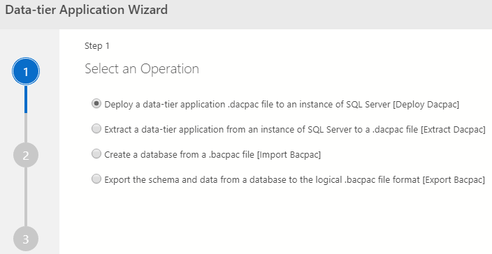

# SQL Server dacpac extension (preview)

**The Data-tier Application Wizard** provides an easy to use experience to deploy and extract .dacpac files and import and export .bacpac files.

This experience is currently in its initial preview. Please report issues and feature requests [here.](https://github.com/microsoft/azuredatastudio/issues)

 ### Requirements
 * This wizard requires an active connection to a SQL Server instance to start.

 ### How do I start the Data-tier Application wizard?
 * The main entry point for the wizard is to right click a database in the Object Explorer, and click **Data-tier Application wizard**.
 * If a user is connected to a SQL Server instance, the user can also start the wizard from the command palette (Ctrl+Shift+P) by searching for **Data-tier Application wizard.**

 ### Why would I use the Data-tier Application wizard?
 This wizard was created to add the ability to extract and deploy .dacpac files and import and export .bacpac files in Azure Data Studio.

## Install the SQL Server dacpac extension

1. To open the extensions manager and access the available extensions, select the extensions icon, or select **Extensions** in the **View** menu.
2. Select the SQL Server dacpac extension and click **Install**.
1. Select **Reload** to enable the extension (only required the first time you install an extension).
2. Navigate to your management dashboard by right-clicking your server or database and selecting **Manage**.
3. Installed extensions appear as tabs on your management dashboard:

## Next steps

To learn more about dacpac's, [check our documentation.](https://docs.microsoft.com/sql/relational-databases/data-tier-applications/data-tier-applications?view=sql-server-2017)